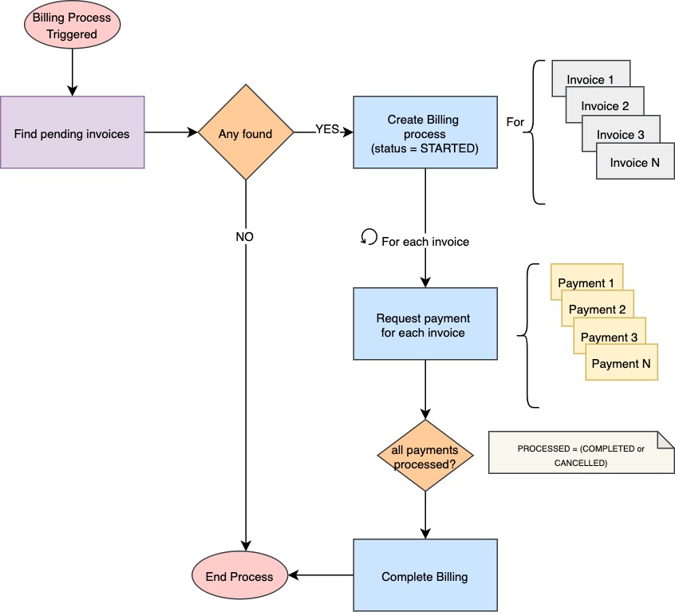
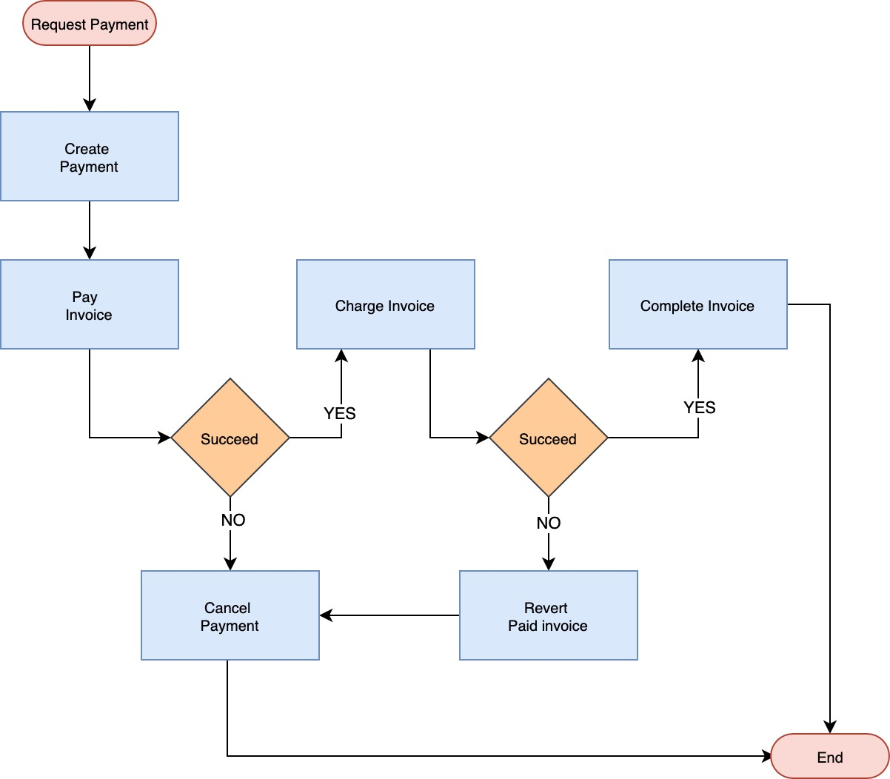
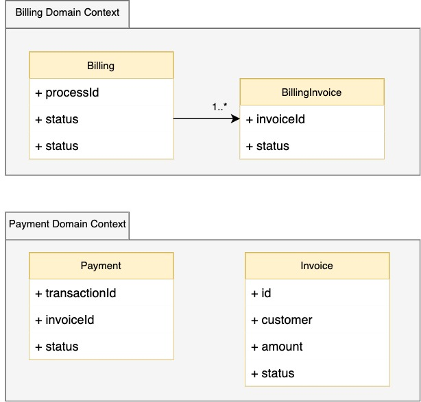
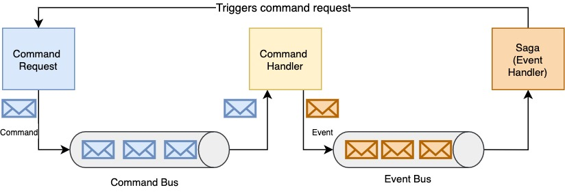

# Antaeus billing process

Welcome to my solution :)


# Overview 

As considering the main problem: *to build the logic that will schedule payment of those invoices on the first of the month*, a simple solution comes at the very beginning but multiple constraints were found on the road which became such simple initial idea into a more robust (sophisticated) solution which hand can face the implications of  well designed software. Thus, following concerns where considered while implementing this solution: *code maintainability, scalability, efficiency, resilience, concurrency, responsiveness, effective thread (CPU) usage*

This way, following concepts were considered in order to tackle  above described concerns: 
 - DDD, Hexagonal Architecture, Even-Driven, functional programming, Reactive fundations, Async, NonBlocking (while communicating with database).

On the other hand, in order to achieve a light solution, I preferred avoid heavy frameworks (aka Spring) in favor of a most simple but also powerful library as Vertx
 
# Solution 
## Desired solution

### Billing general process
As starting point, we want our solution does something like this

 

### Payment process
And as for payment process, something like this:

 
 
# Domain Designing
As we could see, current solution works around two main actors in order to handle entire billing process: *Billing* and
 *Payment*. I did not forge about *Invoice*, this would be directly affected when processing its related *Payment*.
 
## Billing 
This entity represents the entire billing payment (scheduled) process to be triggered on the first of the month, this
 will send to execute a payment for every pending invoice grouped under this entity. 

From above diagram we have: 

|Entity  | Description  |
|--|--|
| Billing | Created every time a new billing process is being triggered (1st of the month)  |
| BillingInvoice | Summarized invoices reference representing the ones which will be attempted to paid along this billing process  |

 Actions taken over this context would be expressed as Command.

|Command    |
|--|--|
|StartBillingCommand   |
|CloseBillingInvoiceCommand  |

Following the same idea, commands will return Events by confirming that requested action was successfully processed

  |Event  |
|--|
  | BillingStartedEvent |
  | BillingInvoiceCompletedEvent|
  |BillingCompletedEvent |


## Payment 
 Represents the *invoice* payment transaction as whole, considering all the steps (status) taken in order to consider a pending invoice successfully processed (PAID). This transaction will have a life cycle defined by following status: 
 
| Payment Status | Description  |
|--|--|
| STARTED | New payment requested |
| COMPLETED | Payment completed, both: PAID and CHARGE successfully processed |
| CANCELED | Something failed, referred invoice should remain in its initial status (PENDING) |

Again, actions over this context domain will be expressed as

|Command    | Description |
|--|--|
|`CreatePaymentCommand`   | Create new command |
|`PayInvoiceCommand`  | Pay invoice, set invoice as PAID |
|`ChargeInvoiceCommand`| Charge invoice through payment provider |
|`CompletePaymentCommand`| Complete payment transaction |
|`CancelPaymentCommand`| Cancel payment transaction |
|`RevertPaymentCommand`| Revert payment to PENDING |   

Considering this commands, we will have these events: 

|Event  |
|--|
|`PaymentCreatedEvent` |
|`InvoicePaidEvent`|
|`InvoicePaidEvent`|
|`InvoiceChargedEvent`|
|`PaymentRevertedEvent`|
|`PaymentCanceledEvent` |    
    
As a summary, we can consider the following diagram

 

# Architecture

As regarding what it was said, implementation is thought to be scalable, resilient and  responsive. Then, a
 message driven (reactive) approach is the most which addapts for this purpose. Then, following diagram explains how
  all above described interacts 
  
   

From above workflow we have that:
 - When _Commands_ are requested by being sent through a message bus
 - A _Command Handler_ consumes such command in order to perform related action over the domain (core)
 - Once this is completed, an _Event_ is sent as notification of any successful command execution
 - _Saga_ pattern is being used as a way to orchestrate span actions caused as consequence of any past action performed
  (Event) in order to manage the payment transaction as a whole


## Code organisation

It's following hexagonal arquitecture where:
 - `pleo-antaeus-core`: contains all domain core business code agnostic of any framework avoiding such dependencies
 - `pleo-antaeus-infra`: Represent infrastucture implementation, such a database implementation
 - `pleo-antaeus-app`: Orchestrate domain business logic by considering main Use Case: Billing Processing
 - `pleo-antaeus-rest`: Containing all endpoints
 
 # Endpoints
 
 As for verification, following endpoints were created in order to check payments and billing final status. 
 
``` GET -  http://localhost:7000/rest/v1/payments ```
``` GET -  http://localhost:7000/rest/v1/billing ```

# Technical Caveats
1. As explained, Saga pattern will ochestrate commands->event->next command sequences. This as asynchronous action
. That is why async command bus are so important
2. Vertx is used in order to define actor model pattern
3. As general rule, I've tried to avoid any blocking call. This way the even loop is more responsive and able to
 manage more request as comparing with blocking solution. Database access were implemented considering this.
